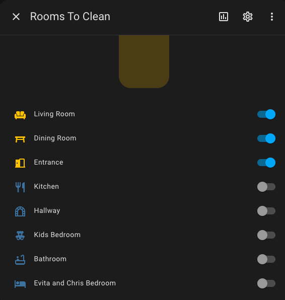

# Roborock-Segment-Clean
# Description
This is to provide instructions and useful tips to perform mutli-segement cleaning of your Roborock vacuum/mop in Home Assistant. This has only been tested on the S8 Pro Ultra.

# Background
The Roborock App allows for the selection of individual rooms or zones to vacuum and mop the selections. The Roborock [Home Assistant Integration](https://www.home-assistant.io/integrations/roborock/) provides for a very useful interface within Home Assistant, but as noted in the documentation, does not yet provide for individual or multiple segment or room cleaning. [Instructions](https://www.home-assistant.io/integrations/roborock/#how-can-i-clean-a-specific-room) are included in the integration page to clean individual or multiple rooms and how to identify these rooms in your logs. Identifying your rooms and the corresponding IDs is a pre-requisite to implementing individual or multi-segment cleaning.

### Problem
The drawbacks of the Roborock integration in its current state is that there is no convenient way to perform specific room cleaning, dynamically. You could create many scripts or automations to clean individual or multiple rooms, but this becomes out of hand when you have many rooms.

## Requirements
1) Your room IDs as identified in [Home Assistant Integration Instructions](https://www.home-assistant.io/integrations/roborock/#how-can-i-clean-a-specific-room)
2) Input_Boolean Entities for each segment (room) -- These are toggle helpers, see [Input Boolean](https://www.home-assistant.io/integrations/input_boolean/) for more information.
3) A Group Helper to contain all of your Input Booleans from #2
4) A Script to perform segment cleaning

### Room IDs
As noted in the background, this is already explained in depth in the Roborock Integration [Instructions](https://www.home-assistant.io/integrations/roborock/#how-can-i-clean-a-specific-room)

### Input Boolean Entities

### Group Helper
The Group Helper described here is not included in Home Assistant and is not to be confused with the Group Helper you can choose in Home Assistant, as that Group cannot include Input_Boolean entities.
To add a group helper that can include input_boolean entities, there are a few steps:
  1) Include the following line in your configuration.yaml file. This can be done through CLI or through the File Editor Add-On

     group: !include groups.yaml

  2) In the same directory as your configuration.yaml file, add a folder named groups.yaml, and add following [sample code.](groups.yaml) Reminder to set the input_booleans specific to your configuration.  

     Once added, your group will be available in Home Assistant as an entity. Note: It will not be under helpers.

     
     

### Script
A [sample script](Selective_Room_Cleaning.yaml) can be utilized.  
  #### What It Does
  When run, the script will run cleaning for the selected rooms when the corresponding input_boolean for the room is in the 'On' state.

  #### Known limitations
  The script in its current form will not clean individual rooms, so a minimum of 2 rooms/input_booleans need to be set in order for the script to work. 

## Putting it all together
I've included my [dashboard yaml](SampleDashboard.yml) to use as an example of how this all can come together. In it, i've done the following:
1) I included the [Lovelace Vacuum Card](https://github.com/denysdovhan/vacuum-card) to provide general functionality
2) I included the card provided by the Roborock integration to provide statistics and other information regarding the vacuum
3) I added the mop mode and mop intensity selectors that are included as part of the Roborock integration
4) Lasly, I included the Group described here that allows me to select which rooms I want to clean, and a button as shown below titled 'Selective Room Clean' that simply runs the script described in this article.

   

Welcome to comments and any improvements that can be made to this, and I hope this is helpful to folks until the official integration provides for a better solution. Credit to the folks in this HA thread for pointers https://community.home-assistant.io/t/how-to-create-a-list-of-multiple-rooms-to-clean-within-an-automation/627729/12

